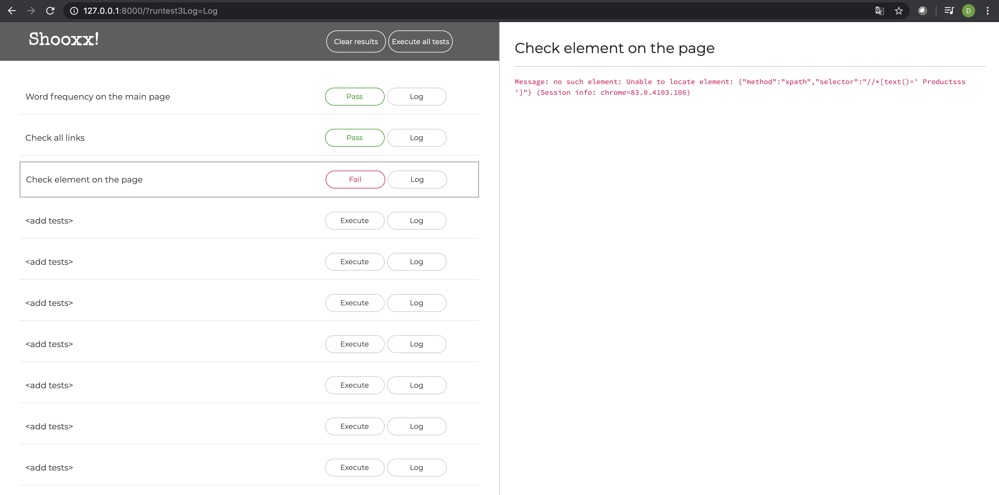

# Shooxx!
Web automation solution. Fast. Reliable. Effective.

## Development server

Based on `Python` and `Django` framework

## Automation approach

I'm using `Selenium` web driver

## Running tests

All tests can be executed directly from the server

## Tests

Added 3 tests:
1. Passed and forwarded log
2. Verified all links on the web site
3. Failed test with the log

## UI

